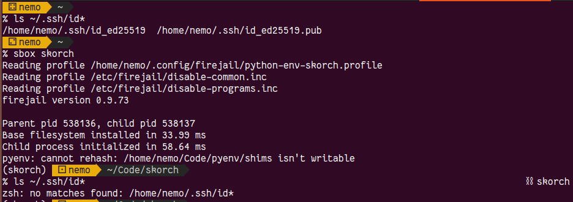
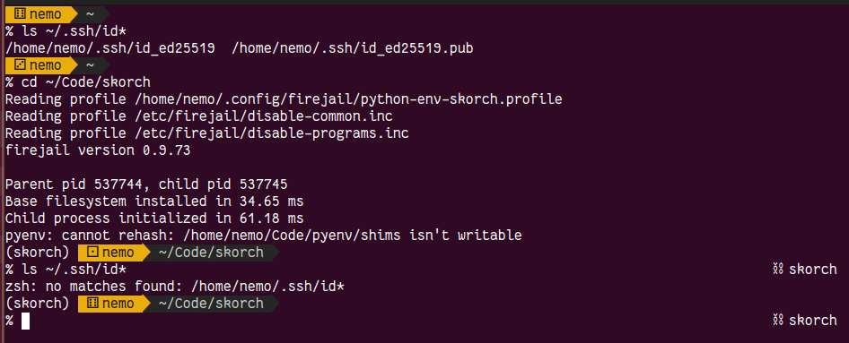

# Python Sandboxing

Do you trust whatever comes out of `pip install`?
Do you [trust nightly builds](https://pytorch.org/blog/compromised-nightly-dependency/)?

A single hijacked package in your dependencies can leak all your secrets
(private keys, tokens, github access, emails, ...).

No? Good! Maybe this is a solution for you, then.

This project aims to provide firejail profiles for python development
environments. This means that you will have an isolated shell with only
selected parts, some read-only, some not at all visible, of your host
filesystem.



This is by no means perfect but at least it is better than being at
the mercy of pypi.

## Requirements

- firejail
- python-virtualenv
- bash or zsh
- Linux based OS (WSL2 *might* work)

## Installation

### Very basic

This will give you the ability to create python sandboxes from a template
and nothing more. No integration into your shell. This is how to do it:
```bash
$ sudo apt install firejail python-virtualenv
$ git clone git@github.com:githubnemo/python-sandbox.git
<add $PWD/python-sandbox to your PATH in .bashrc / .zshrc / ...>
```

This setup assumes that your python envs will live in `~/envs/<sandbox-name>`.

### Advanced shell integration

There are examples for [ZSH](./examples/zsh.md) and [bash](./examples/bash.md)
on how to integrate these sandboxes better into your environment. These features
are showcased in the [Neat Things](#neat-things) section. I'm not confident
enough in these features yet to build a script that you can simply source,
sorry.

## Workflow

New python project? New sandbox.

```
$ mkdir ~/code/mynewproject
$ create-python-sandbox mynewproject ~/code/mynewproject

# After profile creation we can jump into the sandbox
$ firejail --profile=python-env-mynewproject --tab bash

# We can now create a virtualenv there (or use poetry, conda, ...)
$ python -m venv ~/envs/mynewproject
$ . ~/envs/mynewproject/bin/activate
$ pip install [...]
```

It is best to make access to the sandbox as easy as possible.
At best, never leave it (launch a tmux session inside the sandbox,
work in there). Second best: create an alias to quickly jump into
the sandbox. See [section "Common entrypoint"](#common-entrypoint):

```
$ sbox mynewproject
```

## Neat things

### Common entrypoint
I have a function definition for invoking sandboxed shells

```bash
sbox() {
    # replace "bash" with any shell you like
    firejail --profile=python-env-$1 --tab bash
}
```

so I can quickly jump into the sandbox using `sbox myenv`.

### Visual hint of being inside a sandbox
To gauge if I'm in a sandbox or not the sandbox environment
provides an environment variable (`JAILED_ENV=<env name>`) so it is
easy to react on that in the shell prompt.

Example from my `.bashrc`:
```bash
jail=""
if [ -n "$JAILED_ENV" ]; then
    jail="(J:${JAILED_ENV})"
fi

if [ "$color_prompt" = yes ]; then
    PS1='${debian_chroot:+($debian_chroot)}${jail}\[\033[01;32m\]\u@\h\[\033[00m\]:\[\033[01;34m\]\w\[\033[00m\]\$ '
else
    PS1='${debian_chroot:+($debian_chroot)}${jail}\u@\h:\w\$ '
fi
```

### Entering the sandbox upon entering a directory
To enter the sandbox as soon as you're working on a project, you can configure
your shell to watch for `.python-sandbox` files with the sandbox's name in it.



There's an example for ZSH in [`examples/zsh.md`](./examples/zsh.md),
the gist is:

```bash
# Little helper to go upward the directory tree in search for a file.
# Makes sure to use the least amount of external tools for performance.
_upfind() {
    if [[ "$2" -eq 0 ]]; then
        return 1
    fi
    [[ -e "$1" ]] && echo "$1" || _upfind "../$1" "$(($2 - 1))"
}

enable_sbox_if_needed() {
    if [ -n "$JAILED_ENV" ]; then
        return
    fi

    # Look into current and upward directories for sandbox file to
    # enable sandbox upon finding it.
    sandbox_file=$(_upfind ".python-sandbox" 5)

	if [[ "$?" -eq 0 ]]; then
        export PWD_BEFORE_JAIL="$PWD"
        sbox "$(head -n1 "$sandbox_file")"
    fi
}

add-zsh-hook chpwd enable_sbox_if_needed
enable_sbox_if_needed
```


## Caveats

### My bashrc is different in the sandbox :(
Depending on your firejail version, the sandbox bashrc is sourced from
`/etc/skel/.bashrc`. Newer versions of firejail support the `keep-shell-rc`
configuration option. Enable it in the template to avoid this problem.

### Tab completion is not working?!
Note the `--tab` option of firejail. Firejail disables tab completion for
bash since there were vulnerabilities in the implementation before and you
have to supply `--tab` to enable that feature explicitly.


## To do

- [ ] limit access to SSH agent from inside the sandbox
- [ ] limit access to specific read-only tokens (e.g. hf hub)
